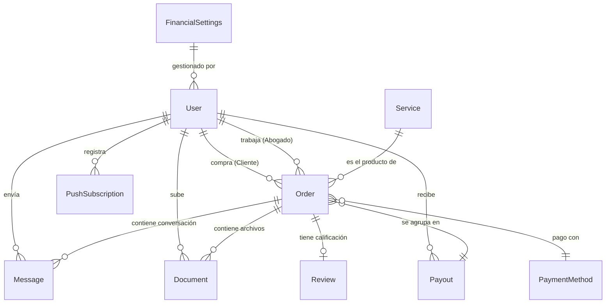

# Documentación de la Base de Datos - VirtuAbogado

Este documento detalla el esquema de datos, las relaciones y los tipos utilizados en el motor de base de datos PostgreSQL a través de Prisma.

---

## 🗺️ Diagrama Lógico de Entidades

---

## 📂 Descripción de Modelos (Principales)

### `User` (Usuarios)
- **Roles**: `CLIENTE`, `ABOGADO`, `ADMIN`.
- **Campos**: Email, Hash de Contraseña (opcional para Supabase Auth), Perfil (DNI, teléfono, dirección), Especialidad y Matrícula (solo para Abogados).

### `Service` (Servicios Legales)
- Los "productos" que el cliente puede comprar.
- **Campos**: Título, Descripción, Precio (Decimal), Imagen.

### `Order` (Órdenes / Casos)
- Es el eje central del sistema. Representa una compra y el caso legal activo.
- **Estados Core**:
  - `PENDIENTE`: Pago verificado, esperando respuesta de admin/abogado.
  - `EN_PROGRESO`: Abogado asignado trabajando en el caso.
  - `PAID`: Pago confirmado (estado técnico post-webhook).
  - `COMPLETADO`: Caso cerrado con éxito.
  - `PAGO_RECHAZADO`: Error en la transacción.
- **Cálculos Financieros**: Almacena el desglose de comisiones (`commissionAmount`), costos operativos y ganancia neta en el momento del pago.

### `Message` (Mensajería)
- Chat interno para cada orden.
- Soporta mensajes de usuario y "mensajes de sistema" (automáticos).

### `FinancialSettings` (Configuración Global)
- Define los porcentajes de repartición de ingresos:
  - `% Comisión Abogado` (default 70%).
  - `% Costos Operativos` (default 10%).
  - `% Impuestos` (default 15%).
  - `% Tarifa de Plataforma` (default 5%).
- También contiene el teléfono de WhatsApp global para contacto.

---

## ⛓️ Relaciones Críticas

1. **Auto-Asignación (Self-Relation)**: La tabla `Order` tiene dos relaciones con `User`: `userId` (quién compra) y `lawyerId` (quién atiende).
2. **Cascada de Notificaciones**: `PushSubscription` está vinculada a `User` con `onDelete: Cascade`. Si se borra el usuario, se limpian sus permisos de push automáticamente.
3. **Mapeo de Payouts**: Un `LawyerPayout` puede contener múltiples `Order`. Esto permite pagarle al abogado varios casos en una sola transferencia.

---

## 📝 Notas Técnicas (Prisma)
- Se utiliza `Decimal` para todos los montos de dinero para evitar errores de redondeo de punto flotante.
- Los índices (`@@index`) están optimizados para las vistas de dashboard (filtrado por estado y fecha de creación descendente).
- Se usa `revalidatePath` en los webhooks para forzar que Next.js limpie el caché de estas entidades tras cambios asíncronos.
