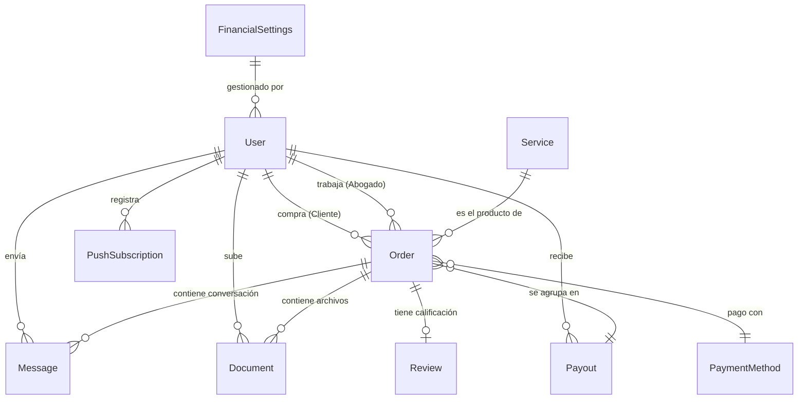

# Documentación de la Base de Datos - VirtuAbogado

Este documento detalla el esquema de datos, las relaciones y los tipos utilizados en el motor de base de datos PostgreSQL a través de Prisma.

---

## Diagrama de Entidades



---

## Modelos Principales

### `User` (Usuarios)
- Roles: `CLIENTE`, `ABOGADO`, `ADMIN`.
- Perfil: DNI, teléfono, dirección, especialidad y matrícula (solo Abogados).

### `Service` (Servicios Legales)
- Productos que el cliente puede comprar.
- Campos: Título, Descripción, Precio (Decimal), Imagen.

### `Order` (Órdenes / Casos)
- Eje central del sistema. Representa compra y caso legal activo.
- Almacena desglose de comisiones al momento del pago.

### `LawyerPayout` (Liquidaciones)
- Agrupa múltiples órdenes completadas para pagar al abogado en una transferencia.
- Estados: `PENDING`, `PAID`, `CANCELLED`, `FAILED`.

### `Message` (Mensajería)
- Chat interno por orden. Soporta mensajes de sistema (automáticos).

### `FinancialSettings` (Configuración Global)
- % Comisión Abogado (default 70%), % Costos Operativos (default 10%), % Impuestos (default 15%), % Tarifa Plataforma (default 5%).
- Teléfono WhatsApp global.

---

## Mapa de Estados de Orden

```
PAGO_PENDIENTE ──> PENDIENTE ──> EN_PROGRESO ──> COMPLETADO
       │                                                   
       └──> PAGO_RECHAZADO                  CANCELADO
```

Nota: `PAID` existe en el enum pero **NO** se usa activamente en el flujo. Los estados reales son `PAGO_PENDIENTE` → `PENDIENTE`/`EN_PROGRESO` → `COMPLETADO`.

---

## Ciclo de Vida de LawyerPayout

1. **Creación Automática**: Al marcar orden como `COMPLETADO`, el sistema agrupa órdenes del mismo abogado en un `LawyerPayout` con estado `PENDING`.
2. **Revisión Admin**: El administrador revisa el payout en el panel de finanzas.
3. **Aprobación**: Admin transfiere manualmente y marca como `PAID`.
4. **Historial**: Los payouts `PAID` quedan registrados para contabilidad.

---

## Relaciones Críticas

1. **Auto-Asignación**: `Order` tiene `userId` (comprador) y `lawyerId` (abogado asignado).
2. **Cascada Push**: `PushSubscription` → `User` con `onDelete: Cascade`.
3. **Agrupación Payouts**: `LawyerPayout` contiene múltiples `Order` para pago agrupado.

---

## Notas Técnicas

- `Decimal` para montos (evita errores de punto flotante).
- Índices optimizados para dashboards (filtro por estado + fecha descendente).
- `revalidatePath` en webhooks para limpiar caché de Next.js tras cambios asíncronos.
